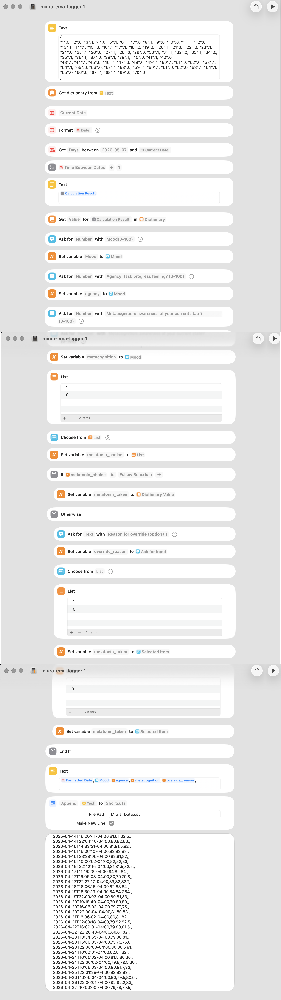

# EMA data collection for N-of-1 studies

Two generations of the same tool: the iOS Shortcut that ran a 70-day N-of-1 affect
study at 92.9% compliance, and the native app that generalizes it so the same design
can be handed to someone else.

The study itself, with its data and analysis, lives in
[N-of-1-Melatonin-Study](https://github.com/haomeng797-ship-it/n-of-1-melatonin-study).
Schedules are generated by [nof1kit](https://github.com/haomeng797-ship-it/nof1kit),
an R package for designing and analyzing single-case studies.

---

## Generation 1: the Shortcut

Ecological momentary assessment three times a day on an iPhone, built entirely in
iOS Shortcuts. A time-of-day automation fires without confirmation, the Shortcut
reads the preregistered schedule for the current study day, prompts for mood,
agency, and metacognition, resolves the melatonin condition (follow the schedule or
record a manual override), and appends a timestamped row to a CSV.

**Install:** open the [Shortcut on iCloud](https://www.icloud.com/shortcuts/6d4fb706f1304f08bb2da3739b9d66b6)
on an iPhone to add it to your own Shortcuts app, then point the final
"Append to File" step at your own CSV.



This is what actually ran for 70 days. Its strength is that the response cost is
close to zero: the prompt appears on its own, and answering never requires opening
an app. That property, more than any feature, is where the compliance rate came
from.

Its limit is distribution. A Shortcut cannot be installed as a study instrument.
Each participant has to duplicate it and edit a file path by hand, there is no
version to cite in a paper, and the logic cannot be reviewed line by line.

Validation and manual-entry fallback for the Shortcut's CSV:

```bash
python src/data_logger.py validate   # out-of-range values, missing entries, duplicate timestamps
```

## Generation 2: the app

A native SwiftUI app in `app/EMALogger/` that keeps the collection design and adds
what a study run by more than one person needs.

| | Shortcut | App |
|---|---|---|
| Timed prompts | yes | yes |
| Three ratings + melatonin | yes | yes |
| Preregistered schedule | reads `schedule.json` | imports the same JSON, or a built-in sample |
| Deviation from schedule | free-text note | detected automatically, flagged per entry |
| Compliance | not computed | slots answered within a response window, over slots elapsed |
| Response windows | none | configurable, with live open/closed status |
| Range validation | separate Python step | enforced on every write |
| Distribution | duplicate and edit by hand | one install |
| Reviewable | binary | source, in this repository |

**Interoperability.** The app exposes three App Intents, so a Shortcut can remain
the front end and call the app as its backend: `Get tonight's assignment`,
`Get current study day`, and `Log a check-in`. The near-zero response cost of
generation 1 is preserved, while the bookkeeping moves into the app.

**Notifications.** Reminders are re-queued for the next 14 days each time the app
opens, which keeps a 70-day study inside the iOS limit of 64 pending notifications.

**Export.** CSV with ISO 8601 timestamps, `NA` for missing values, and 0/1 for
logicals, so `read.csv()` takes it without cleaning. The schedule exports as well,
since analysis needs it to recover each day's assignment.

**Building.** Requires Xcode 26 or later. Open
`app/EMALogger/EMALogger.xcodeproj` and run on a simulator or device. No
dependencies.

## Measurement

Three prompts per day (morning, afternoon, evening). Each entry records:

| Variable | Prompt | Scale |
|---|---|---|
| `mood` | current emotional valence | 0–100 |
| `agency` | sense of task progress | 0–100 |
| `metacognition` | awareness of current state | 0–100 |
| `melatonin_taken` | melatonin taken last night | 0 / 1 |
| `override_reason` | deviation note | free text |

## Repository layout

- `app/EMALogger/` — the native app (Swift, SwiftUI)
- `src/data_logger.py` — validation and manual-entry fallback for the Shortcut CSV
- `schedule.json` — the preregistered 70-day randomized schedule used in the study
- `assets/` — documentation images
- `data/` — collected CSVs (not tracked)

## License

Released under CC-BY 4.0.
